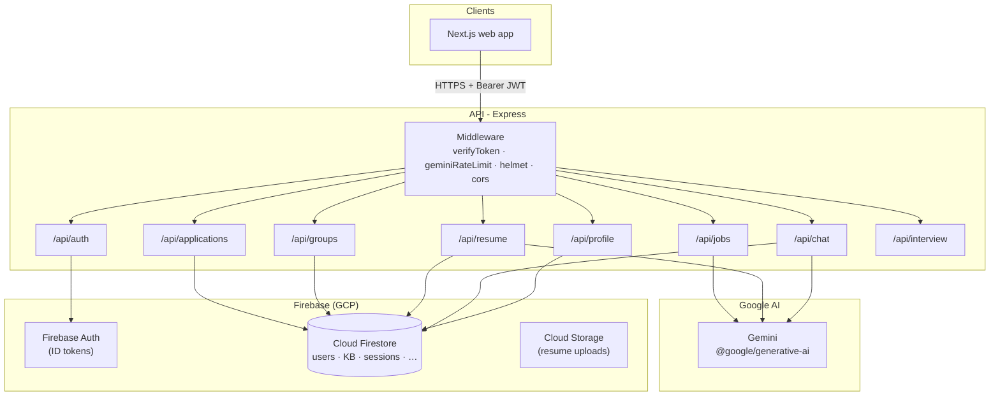
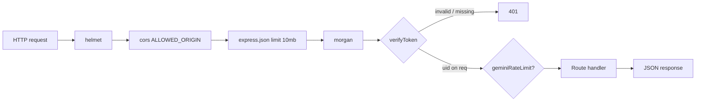
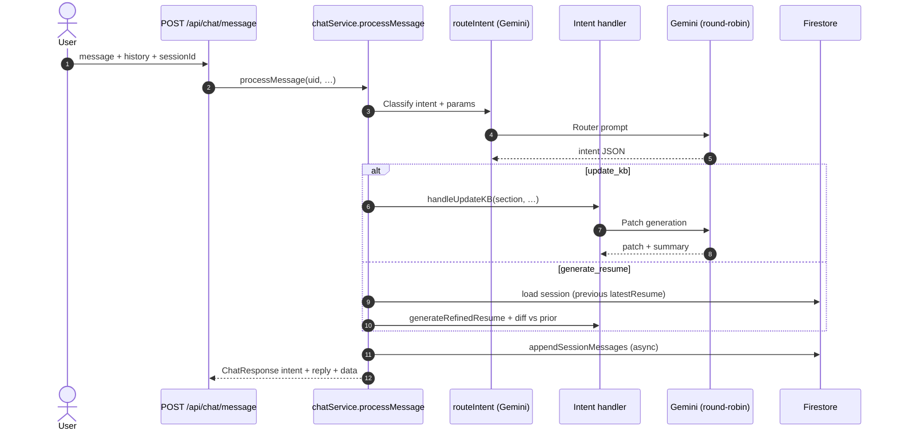
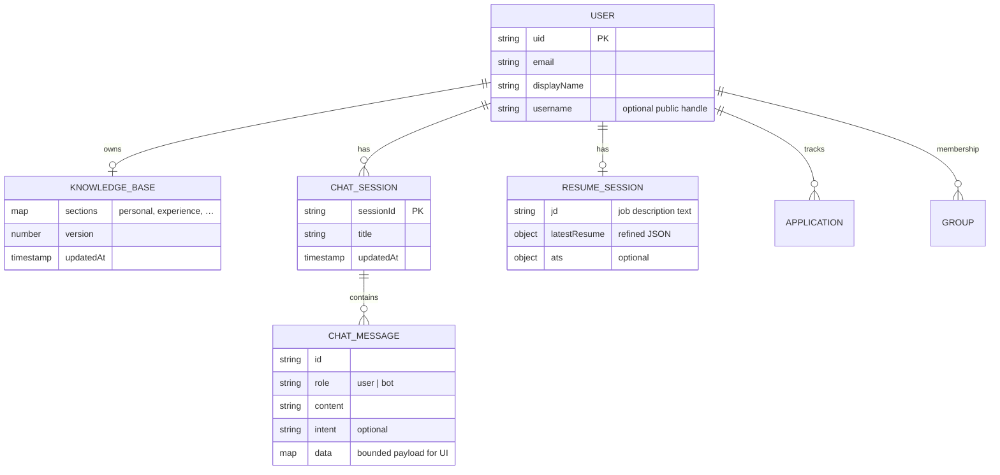

<div align="center">

# ResumeForge API

### AI-assisted resume, knowledge base, and interview preparation - backend service

[](https://nodejs.org)
[](https://www.typescriptlang.org)
[](https://expressjs.com)
[](https://firebase.google.com)
[](https://ai.google.dev)

> Stateful **Express** API: Firebase-verified users, **Firestore** persistence, **Google Gemini** for routing and generation - with **multi-key round-robin**, **merge-safe KB writes**, and **structured chat payloads** so the web UI can confirm updates after refresh.

[Problem & solution](#the-problem) · [Architecture](#architecture) · [AI design](#ai--chat-design) · [Data model](#data-model-firestore) · [API reference](#api-reference) · [Packages](#key-npm-dependencies) · [Environment](#environment-variables) · [Quick start](#quick-start)

</div>

---

## The problem

Job seekers juggle **scattered facts** (resume files, bullet lists, JD text) and generic chat tools that:

- **Hallucinate or overwrite** structured profile data instead of merging safely
- **Lose context** across tabs, refreshes, and "confirm this change" flows
- **Hit API quotas** quickly when every chat turn triggers multiple LLM calls

---

## The solution

ResumeForge API provides a **single authenticated backend** where:

1. **Resume upload → KB extraction** grounds every later AI call in a canonical **knowledge base** document per user.
2. **Intent-based chat** routes user text through Gemini (`routeIntent` → handlers like `update_kb`, `generate_resume`, `interview_prep`).
3. **KB section updates** apply **merge-by-id** for array sections and **shallow merge** for objects, then **sanitize** before Firestore write - avoiding blind full-section replacement that drops rows.
4. **Multiple Gemini API keys** rotate **round-robin** (`nextGoogleGenerativeAI`) so heavy usage spreads across keys.
5. **Chat sessions + messages** persist to Firestore; critical bot rows (e.g. `update_kb`) include bounded **`data`** so "Confirm" still works after reload.

---

## Features

| Area | Capability |
|------|------------|
| **Auth** | Firebase ID token verification (`Authorization: Bearer`) via Admin SDK |
| **Knowledge base** | Versioned KB, history, JSON import, section patch with normalization (`normalizeKbSection`), rollback |
| **Chat** | Per-user sessions; `POST /message` with `sessionId`, history, optional **continuations** (group pick, peer compare) |
| **Intent routing** | Gemini classifies user message → structured intent + params |
| **Resume / session** | Tailored generation, ATS, cover letter, job fit, PDF export; session holds JD + `latestResume` for diffs |
| **Interview prep** | General vs role-specific questionnaires (Gemini + KB), persisted with JD fingerprint for staleness |
| **Groups** | Create, invite, bulk KB updates, peer comparison |
| **Jobs (optional)** | Search / profile / salary intel when third-party keys are set |
| **Rate limiting** | `geminiRateLimit` on chat and other Gemini-heavy routes |
| **Ops** | `/health`, `/api/health`, Helmet, CORS allow-list, structured logging (`morgan`) |

---

## Architecture



### Request pipeline (authenticated route)



---

## AI & chat design

### Perceive → route → act

The chat stack is **not** a single open-ended completion: it **routes** first, then runs **domain handlers** that may perform multiple Gemini calls and Firestore reads/writes.



### What makes it "agentic" (structured control flow)

| Property | Implementation |
|----------|----------------|
| **Route** | `routeIntent` returns `{ intent, params, reply }` - downstream code switches on `intent`, not raw prose |
| **Structured UI state** | `update_kb` bot messages persist `data: { section, patch, patchSummary, currentSection }` for DiffCard + confirm |
| **Merge safety** | `updateKBSection` merges arrays by stable `id`, objects shallow-merge; then `sanitizeGeminiKbResponse` |
| **Timeouts** | Long Gemini steps wrapped (e.g. `withTimeout`) to avoid hung requests |
| **Quota spread** | `nextGoogleGenerativeAI()` picks the next key per operation from env-configured pool |

### Gemini API keys - resolution & rotation

Implementation: `src/lib/geminiKeys.ts`.

1. **`GEMINI_API_KEYS`** - split on comma, newline, or semicolon; duplicates removed.
2. **`GEMINI_API_KEY_1` & `GEMINI_API_KEY_10`** - if step 1 yields nothing.
3. **`GEMINI_API_KEY`** - single fallback.

Rotation is **module-level round-robin** (not sticky per user): each call to `nextGoogleGenerativeAI()` advances an index modulo key count.

---

## Data model (Firestore)

Conceptual schema (collection names are illustrative; see `lib/*Service` for exact paths).



---

## API reference

Base path: **`/api`** (mount point in `src/index.ts`). All authenticated routes expect:

```http
Authorization: Bearer <Firebase ID token>
```

### Health

| Method | Path | Auth | Description |
|--------|------|------|-------------|
| `GET` | `/health` | No | Liveness JSON |
| `GET` | `/api/health` | No | Same (proxy-friendly) |

### Auth (`/api/auth`)

| Method | Path | Description |
|--------|------|-------------|
| `POST` | `/onboard` | First-time user profile setup |
| `GET` | `/me` | Current user doc |

### Profile (`/api/profile`)

| Method | Path | Description |
|--------|------|-------------|
| `GET` | `/public/:username` | Public profile (no auth) |
| `GET` | `/` | Authenticated profile |
| `PATCH` | `/` | Update profile fields |
| `GET` | `/kb` | Knowledge base |
| `POST` | `/kb/import` | Import KB JSON |
| `POST` | `/kb/update` | Section patch (`section`, `patch`) - merged server-side |
| `GET` | `/kb/history` | KB version history |
| `POST` | `/kb/rollback` | Restore version |
| `GET` | `/notifications` | Notifications |
| `PUT` | `/settings` | User settings |
| `GET` | `/activity` | Activity feed |
| `POST` | `/notifications/mark-read` | Mark read |
| `DELETE` | `/account` | Delete account |

### Chat (`/api/chat`)

| Method | Path | Notes |
|--------|------|------|
| `POST` | `/message` | **`sessionId` required**; optional `continuation` |
| `GET` | `/sessions` | List sessions |
| `POST` | `/sessions` | Create session |
| `PATCH` | `/sessions/:sessionId` | Rename |
| `DELETE` | `/sessions/:sessionId` | Delete |
| `GET` | `/history` | Legacy/global history if implemented |
| `DELETE` | `/history` | Clear |
| `GET` | `/interview-prep` | Saved prep + `jdStale` |
| `POST` | `/interview-prep` | Body: `{ mode: 'general' \| 'role', jd? }` |

**Example: chat message**

```json
{
  "sessionId": "uuid-session-id",
  "message": "Update my experience section to add …",
  "history": []
}
```

**Example: KB section update (confirm from UI)**

```json
{
  "section": "experience",
  "patch": [ { "id": "…", "company": "…", "title": "…" } ]
}
```

### Resume (`/api/resume`)

| Method | Path | Description |
|--------|------|-------------|
| `GET` | `/session` | JD + latest refined resume + metadata |
| `POST` | `/generate` | Trigger generation (see route body) |
| `POST` | `/pdf` | PDF export |
| `POST` | `/ats` | ATS scoring |
| `POST` | `/cover-letter` | Cover letter |
| `POST` | `/job-fit` | Fit assessment |
| `GET` | `/latest` | Latest artifact shortcut |

### Groups (`/api/groups`)

Create, list, invites, **bulk-update** preview/apply, **peer-compare**.

### Applications (`/api/applications`)

CRUD + `from-resume-session` linkage.

### Jobs (`/api/jobs`)

Optional integrations: search, profile, weak spots, salary intel (requires env keys).

### Interview career (`/api/interview`)

Job-application-style interview sessions (separate from chat interview-prep questionnaires).

---

## Key npm dependencies

| Package | Role |
|---------|------|
| `express` | HTTP server and routing |
| `firebase-admin` | Verify ID tokens, Firestore, Storage |
| `@google/generative-ai` | Gemini client construction per key |
| `cors` | Origin allow-list |
| `helmet` | Security headers |
| `morgan` | Request logging |
| `dotenv` | Local configuration |
| `multer` | Multipart uploads |
| `pdf-parse` | Resume PDF text extraction |
| `puppeteer` | PDF / rendering where used |
| `uuid` | Message and session IDs |

---

## Environment variables

Copy **`.env.example`** → **`.env`**. Critical entries:

| Variable | Purpose |
|----------|---------|
| `FIREBASE_SERVICE_ACCOUNT_JSON` *or* `FIREBASE_ADMIN_*` | Admin SDK credentials |
| `FIREBASE_STORAGE_BUCKET` | Storage bucket name |
| `GEMINI_API_KEYS` or `GEMINI_API_KEY_*` or `GEMINI_API_KEY` | Gemini pool |
| `GEMINI_MODEL` | Optional; else startup probe picks a working model |
| `PORT` | Listen port (default **4000**) |
| `ALLOWED_ORIGIN` | Comma-separated CORS origins (prod + preview URLs) |
| `APP_PUBLIC_URL` | Public web origin for links |

Optional: `JSEARCH_API_KEY`, `ADZUNA_*`, `APIFY_API_TOKEN`, `SERPAPI_KEY` - see `.env.example`.

---

## Quick start

### Prerequisites

- **Node.js >= 18**
- Firebase project (**Auth** + **Firestore** + **Storage**)
- At least one **Gemini API key**

### Run locally

```bash
cd apps/api
cp .env.example .env
# Fill Firebase admin fields and GEMINI_* keys
npm install
npm run dev
```

Server listens on **`http://localhost:4000`** (or `PORT`). Verify:

```bash
curl http://localhost:4000/health
# {"status":"ok","timestamp":"…"}
```

### Build & production

```bash
npm run build    # tsc → dist/
npm start        # node dist/index.js
```

| Script | Purpose |
|--------|---------|
| `npm run dev` | `ts-node-dev` hot reload |
| `npm run build` | Typecheck + emit |
| `npm run gemini:probe` | Probe configured Gemini model IDs |

---

## Design trade-offs

> **Express vs serverless functions:** A long-lived Node process fits **WebSocket-free** batching, shared rate-limit state, and predictable Puppeteer use - deploy targets include Railway, Render, Fly, or VM.

> **Firestore vs SQL:** User-scoped documents map naturally to KB versions, chat sessions, and resume sessions; complex joins are avoided in favor of denormalized session snapshots.

> **Round-robin vs sticky routing:** Simplicity and even spread across keys; per-user affinity can be added later if needed.

---

## Related

- Client app: [`../web/README.md`](../web/README.md)

---

<div align="center">

**ResumeForge** - structured AI around real career data.

</div>
